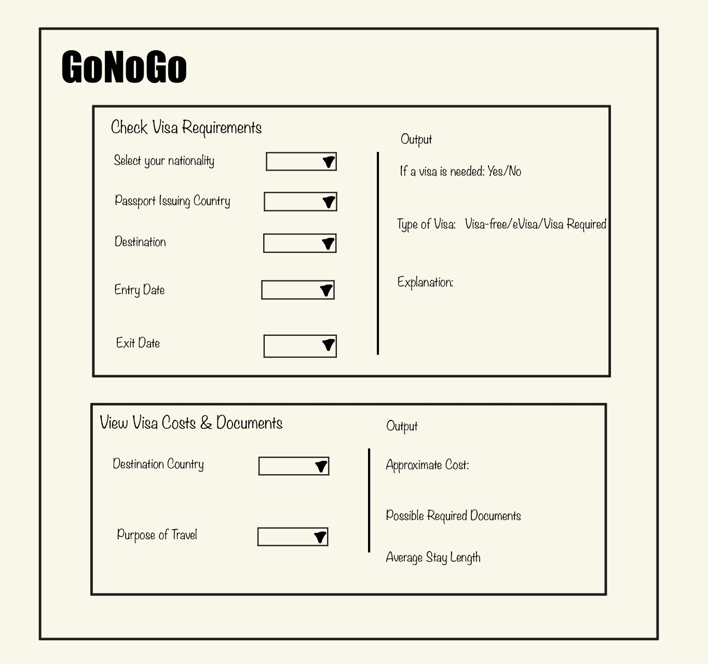

# Project Title: GoNoGo

---

## Summary

This project is a web application that helps users figure out visa requirements for an international trip based on their nationality, current visa status, destination, and travel dates.

The app has two pages: one where users input their nationality and any existing visa or other relevant info, and another where they input their destination and time of travel. This second page would then output the visa rules that apply to their trip, including relevant info like do they need to apply for a travel visa, how long they can stay, how much would a visa cost, etc.

---

## Creative Component

Our creative component would include using databases to develop a Visa Intelligence system that would enhance the application through visualization and SQL-based computation.

### An interactive global visa map:

We can have a world map sort of overview where after we put in all our information. We can traverse through this dynamic world map and each country will be color-coded based on a specific set of ranking systems. We would utilize colors to indicate countries where we can go visa-free, receive a visa on arrival or an e-visa, where an actual appointment is required to get a visa and finally countries which have restricted arrival for your current visa status. We can allow users to hover through this world map so they could be better equipped to actually plan their destination trip. We can achieve this by having a schema of a DB table for all the countries along with a DB table for visa rules and visa costs and use joins to actually compute what color coding goes into a particular location. We would use UI tools to actually make this color coded using our SQL outputs. We plan to also add toggles where we would see the map using eligibility rules and by visa costs and we can even have a toggle to display average costs for a particular region such as Latin America, Mediterranean Europe, Eastern Europe, Eastern Asia and Southern Asia. We would use cursors to access region information and for our map data.

### Smart Trip Planner:

We plan to create automated trip planner systems where a user would input their nationality which would be stored when they log in to the software, their budget range, their trip length as well as the region of their choice and then we would display (if any) results that tailor to their filtering preferences. We aim to use cursors as well as joining and filtering logic here to display our results. We would also be able to rank trips based on the strength of the filter matching. We would use frontend tools to return a JSON list.

### Complexity score for our travel:

We would display the complexity of performing a travel plan to a particular destination. We would weigh our complexities based on a formula whether a visa is required, whether the cost of the visa is not feasible (comparing it with a standard price like $100), whether it is feasible to stay as long as intended in that location, whether long or short duration. We would use UI tools to display complexity just like the way grammarly would display the writing score while checking for grammar errors. We would compute the score using SQL by using cases.

---

## Usefulness

Planning an international trip can be confusing because visa information is not always easy to find or compare. Most travelers have to search multiple embassy websites, government pages, or blog posts just to understand whether they need a visa, how much it costs, and how long they can stay. Sometimes the information is outdated or unclear, which makes the process stressful and time-consuming. This becomes even harder when someone is comparing several countries or planning a trip to multiple destinations.

GoNoGo helps simplify this process by putting visa information in one place. Instead of searching country by country on different websites, users can enter their nationality and destination to quickly see whether a visa is required, what type it is, how long they can stay, and the estimated cost. The app also shows required documents and other important details so users can prepare in advance. This makes travel planning more organized and reduces the risk of missing key requirements.

There are websites like Henley & Partners, https://www.henleyglobal.com/countries, that publish passport rankings and visa-free access information, but they mainly focus on ranking passports rather than helping users plan real trips. Government embassy websites provide official information, but users must search each country separately and interpret the rules themselves. GoNoGo is different because it combines visa rules, costs, and regional data in one system. Users can search by region, compare multiple destinations at once, and explore travel options more easily.

The application includes both simple and advanced functionality. Basic features allow users to search visa requirements between one origin and one destination. More advanced features include filtering by region, estimating visa costs, calculating travel complexity scores, and viewing aggregated regional statistics. The two approaches allow the application to be useful not only for individual travelers, but also for students studying abroad, business travelers comparing global mobility, and users planning multi-destination trips.

### Key Benefits

- Simplifies Research: User get immediate answer and VISA needs and types without sourcing government cites  
- Financial Transparency: It provides estimated visa costs upfront, helping travelers budget for their trip more accurately.  
- Pre-Trip Readiness: The app lists required documents and average stay lengths to ensure users are fully prepared.  
- Regional Discovery: Users can find visa rules for entire regions like "Asia," making it easier to plan multi-country trips.  
- Data Accuracy: By merging the passport-index-tidy dataset with more recent updates, it offers a more reliable view than single sources.  
- Data Reliability: The app merges historical datasets with manual updates to ensure more current information.

---

## Realness

One source of data is the passport-index-tidy.csv provided by https://github.com/ilyankou/passport-index-dataset. This dataset lists the visa needed to go from one country to another, 3 features in total. It has nearly 40000 entries, so it is mostly exhaustive. However, it only lists the type of visa needed, and does not include the price and other details needed.

It also is only maintained until January 2025, so any changes made in the past year are not recorded. https://www.henleyglobal.com/passport-index provides the same data (pdf) as the dataset above, but is more up to date. However, it needs manual downloading by country, so we plan to use the first dataset and update any changes in the past year according to this dataset.

The Global visa cost dataset (csv) provides the cost of obtaining visas for different countries. We only need the travel visa portion, so we need the first 5 features. There are 38609 rows for each relationship between 2 different countries. We may need to update certain entries, as this dataset was created in 2019. Source: https://cadmus.eui.eu/entities/publication/7b528402-ae0e-50ef-ae9f-d1c1bb976b1f

Another datasets we may use is the list of names of countries and their ISO code for setting up the relationship between datasets. THis is an approximately 200 row pdf dataset with 2 features: the name of the country and their ISO code. Source: https://www.att.com/support_media/images/pdf/Country_Code_List.pdf

Countries of the World can be used to allow for regional searches such as “give me all visa conditions of all countries in Asia”, a possible advanced function. It is a 227 row csv dataset with 2 relevant features, country and the region it belongs to. Source: https://www.kaggle.com/datasets/fernandol/countries-of-the-world

---

## Functionality

GoNoGo allows users to look up, compare, and plan their trips using a centralized database of visa rules, required documents, and regional mappings. The system also supports users to manage their profiles and allows admins to maintain visa data over time. Specifically, here is a detailed list of the functionality:

1) Users would submit a form with their nationality, passport, destination, and travel dates when they want to get information about visa requirements for travelling to another country. The program will return if a visa is needed, the type of visa if needed, and a short explanation.
2) Users would search to choose the country they plan to visit to see the visa requirements and related details. The program will return an approximated travel-visa cost and possible documents needed to apply for the visa, and the average stay length of the visa.
3) Users can create accounts to store their nationality/visa information for their convenience of using GoNoGo multiple times.
4) Users can update their profile and delete their account.
5) Users who are logged in can store their trip and view their trip anytime in their account

---

## UI mockup

---

## Project work distribution

### Jeny Sheng: Country and Identity module

_Design the country table and the iso_code table, process data for these tables._  
_Do country alias normalization_  

**Database Responsibilities:**
- Design and implement a countries table with a primary key, name, ISO code, and what region the country belongs to.
- Design and implement an ISO table for country code data.
- Clean the data so that there’s no incorrect NULL data and to keep our code consistent.
- Maintain database integrity and relationships with other tables (visa rules, costs, regions).

**Backend Responsibilities:**
- Write SQL queries for inserting and updating country and ISO code data.
- Develop stored procedures or queries to retrieve country information for frontend use.

**Frontend Responsibilities:**
- Help our map feature by providing country metadata which includes name, ISO code, region for frontend visualization.

---

### John Wang: Visa requirement

_Design the visa_requirement table, process data for the table.  
Parse passport-index dataset  
Update recent changes_  

**Database Responsibilities:**
- Design and implement visa_requirements table to include the details of the user such as origin, destination, visa type, max stay, and application type.
- Find and use the datasets to fill the visa_requirements table.
- Update visa rules with recent changes from the Henley Global dataset.

**Backend Responsibilities:**
- Write SQL queries and joins to retrieve visa eligibility based on nationality and destination.
- Implement filtering and ranking logic for visa rules using CASEs and cursors.

**Frontend Responsibilities:**
- Provide data for interactive map color-coding.

---

### Akshay Akhileshwaran: Cost and documentation

_Design the visa_cost table and the document_required table, process data for these tables.  
Parse global visa cost dataset  
Update recent changes_  

**Database Responsibilities:**
- Design and implement visa_cost table (origin, destination, visa cost, currency, fees).
- Design and implement document_required table for visa applications.
- Parse the Global Visa Cost dataset and populate both tables.
- Update cost and document data as new information becomes available.

**Backend Responsibilities:**
- Write queries to calculate total visa cost and retrieve required documents per destination.
- Support our smart trip planner by joining cost, document, and visa requirement data.

**Frontend Responsibilities:**
- Return cost and document info as JSON for displaying data in our tables and our interactive trip planner.

---

### Zhiyun Liu: Region and aggregation

_Design regions table, process data for the table.   
Import countries-of-the-world dataset  
Maintain regions and sub-regions._

**Database Responsibilities:**
- Design and implement the regions table, linking countries to regions and sub-regions.
- Import countries-of-the-world dataset and maintain regional mappings.
- Aggregate visa costs and eligibility by region using SQL GROUP BY queries.

**Backend Responsibilities:**
- Make queries for creating region-based toggles in the interactive map.
- Compute regional averages (e.g., average visa cost, average stay) for visualization.

**Frontend Responsibilities:**
- Enable toggles to switch map views based on users preferences of filtering by region or aggregated statistics.
- Provide data for comparisons between separate regions and for our smart trip planner filtration.
